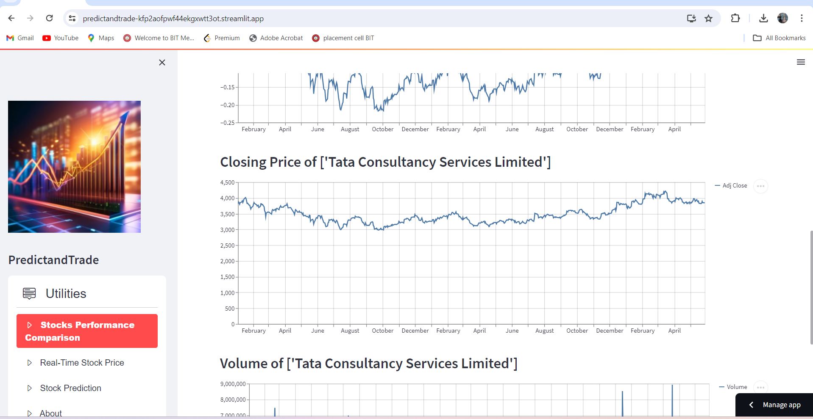

# PredictandTrade

<b>check the project Live at</b> -  https://predictandtrade-kfp2aofpwf44ekgxwtt3ot.streamlit.app/

PredictandTrade is a web application that allows users to visualize Stock Performance Comparison, Real-Time Stock Prices, and Stock Price Prediction. This application is developed using Streamlit, an open-source app framework in Python. Streamlit helps users to create web apps for Data Science and Machine Learning in a short time.

## Features

- **Stocks Performance Comparison**: Compare the performance of multiple stocks over a specified date range.
- **Real-Time Stock Price**: View real-time stock prices and plot them using different types of charts.
- **Stock Prediction**: Predict future stock prices using the Prophet library and visualize the forecast.

## Screenshots

### Home Page


### Stocks Performance Comparison


### Real-Time Stock Price


### Stock Prediction


### About


## Installation

1. Clone the repository:

    ```bash
    git clone https://github.com/your-username/predictandtrade.git
    cd predictandtrade
    ```

2. Create a virtual environment and activate it:

    ```bash
    python -m venv venv
    source venv/bin/activate  # On Windows use `venv\Scripts\activate`
    ```

3. Install the required packages:

    ```bash
    pip install -r requirements.txt
    ```

4. Run the Streamlit app:

    ```bash
    streamlit run app.py
    ```

## Usage

- **Select the desired utility** from the sidebar: Stocks Performance Comparison, Real-Time Stock Price, or Stock Prediction.
- **Pick the assets** you want to analyze or predict from the dropdown menu.
- **Choose the start and end dates** for the analysis.
- **View and interact** with the charts and data displayed.

## Contributing

Contributions are welcome! Please open an issue or submit a pull request for any improvements or bug fixes.


## Acknowledgements

- [Streamlit](https://streamlit.io/)
- [yFinance](https://pypi.org/project/yfinance/)
- [Prophet](https://facebook.github.io/prophet/)

\


